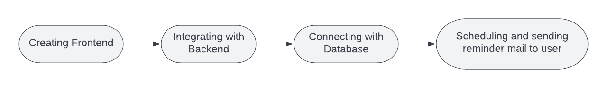
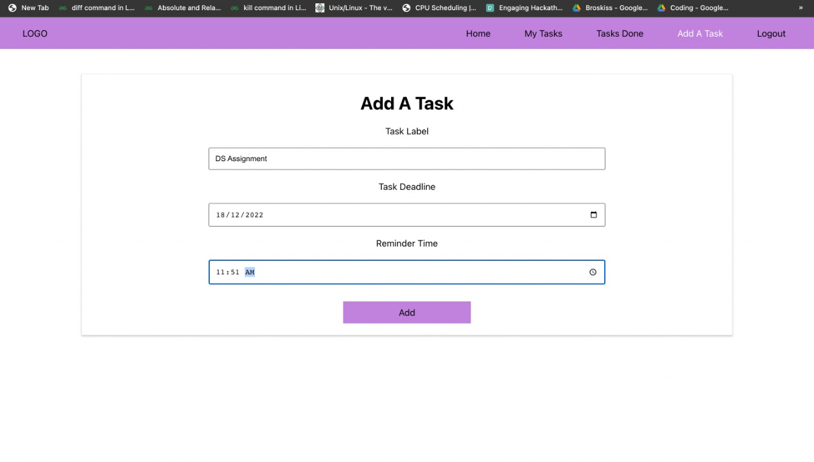
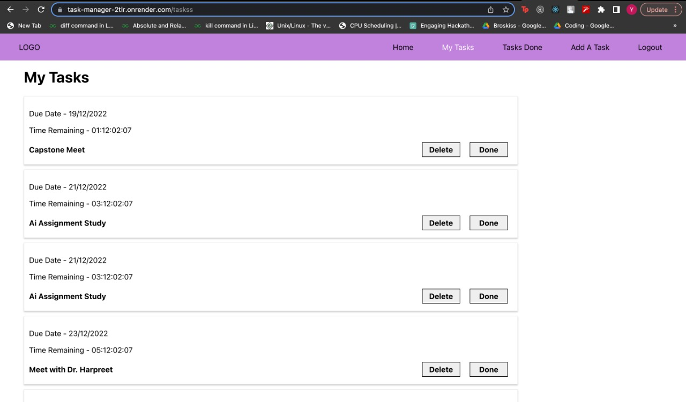
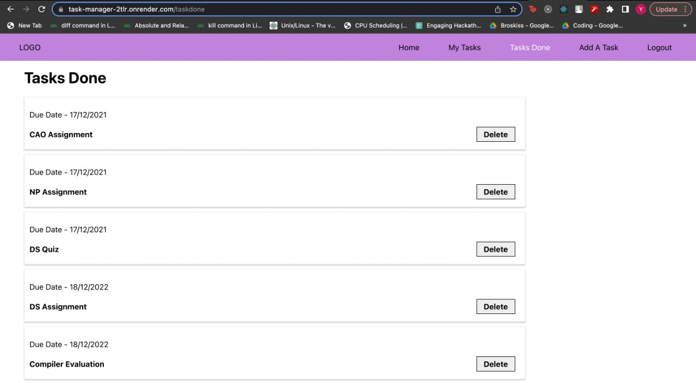
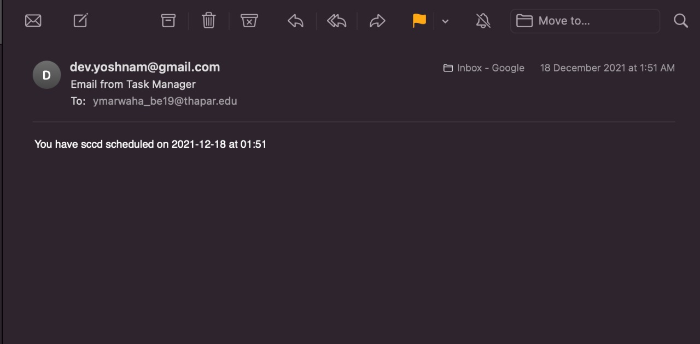

# Title: Task Manager - A work organizer

## 1. Methodology

<h1>

</h1>

## 2. Description

Task Manager is a web application that allows users to manage their daily tasks easily and on priority basis.It maintains a countdown for deadlines of tasks and also sends a reminder to the user on mail about the deadlinewhich is donw using node mailer scheduler. It has Google OAuth for authentication and authorization, uses Express as a minimal and flexible framework for Node.js and hass MongoDB (No SQL) database.

## 3. Input/Output

Set tasks and their deadline as input.  
Get priority based tasks and reminder before deadlines as output.

## 4. Live Link

Link - https://task-manager-2tlr.onrender.com

## 5. Screenshots

### Add a task

<h1>

</h1>

### My tasks

<h1>

</h1>

### Tasks done

<h1>

</h1>

### Reminder mail send to user

<h1>

</h1>
